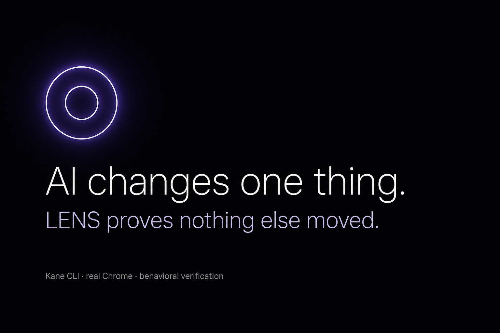
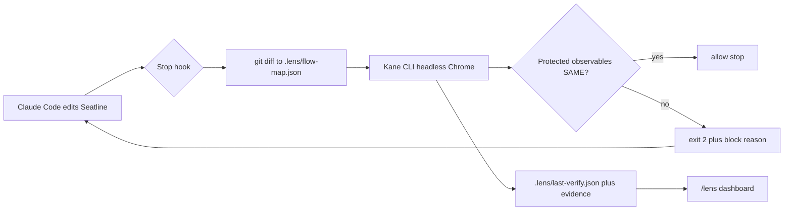

<div align="center">



&nbsp;

[](https://github.com/Enoch208/lens/actions/workflows/verify.yml)
[](LICENSE)


[](https://lens-seatline.vercel.app/)

### The agent does not decide when it is done. Kane CLI does — in real Chrome, against business flows written as plain English.

**Seatline** is a five-member B2B workspace-billing app. **LENS** is the verification gate that
makes building it with Claude Code safe to ship: on every attempted stop, a hook maps the git
diff to the business flows it could break, replays the matching `.testmuai/tests/*_test.md`
contracts in headless Chrome, compares what Kane actually observed against a trusted baseline,
and **blocks the agent** until every protected observable is `SAME` or an authorized
`EXPECTED_CHANGE` — not when the model says it is done.

**[ Live app ↗ ](https://lens-seatline.vercel.app/)** &nbsp;·&nbsp; **[ Judge it in 90 seconds ↗ ](#judge-lens-in-90-seconds)** &nbsp;·&nbsp; **[ The failure it catches ↗ ](#the-failure-it-catches)** &nbsp;·&nbsp; **[ How LENS decides ↗ ](#how-lens-decides)**

</div>

---

## Judge LENS in 90 seconds

**Live console: [lens-seatline.vercel.app](https://lens-seatline.vercel.app/)** — landing on
Vercel, Seatline under `/overview` `/members` `/billing`, and the verification dashboard on
[`/lens`](https://lens-seatline.vercel.app/lens). Kane itself runs locally (it needs a real
Chrome and a Kane login); production `/lens` renders the last committed verify snapshot from
`.lens/`.

Everything also runs locally in four commands — Kane CLI replays the four business flows in
headless Chrome against your own dev server.

Four numbers, all reproducible from this repository:

| | |
|---|---|
| **4 / 4** | business flows Kane must hold on every full verify — removal, invite, role-change, billing |
| **31** | browser steps across the four `_test.md` contracts (7 + 9 + 7 + 8) |
| **0 credits** | on replay after the first authoring run — committed `output-*/` recordings replay for free |
| **exit 2** | Stop hook blocks Claude Code with Kane's structured failure until protected behavior holds (max 3 attempts) |

```bash
npm install && npm run dev              # http://localhost:3000

npm i -g @testmuai/kane-cli && kane-cli login
npm run lens -- verify --all            # expect: protected flows SAME / EXPECTED, exit 0
open http://localhost:3000/lens         # same verdict as a live status page
open http://localhost:3000/demo/reset   # deterministic reseed — step one of every Kane flow
```

---

## Table of contents

- [The failure it catches](#the-failure-it-catches)
- [The problem](#the-problem)
- [What I built](#what-i-built)
- [Architecture](#architecture)
- [How LENS decides](#how-lens-decides)
- [The Kane contract](#the-kane-contract)
- [Engineering decisions](#engineering-decisions)
- [How the demo regression was produced](#how-the-demo-regression-was-produced)
- [The live console](#the-live-console)
- [Honesty: limitations](#honesty-limitations)
- [Tech stack](#tech-stack)
- [Project layout](#project-layout)
- [Run it locally](#run-it-locally)
- [Tests](#tests)
- [Attribution](#attribution)

---

## The failure it catches

Everything below is real output from this repository, produced on 2026-08-21 by Kane CLI driving
a real Chrome. See [How the demo regression was produced](#how-the-demo-regression-was-produced)
for exactly which part of it was deliberate.

The request is one sentence:

> Add annual billing to Seatline. Annual customers should receive a 10% discount, show the
> savings clearly in the billing breakdown, and keep monthly billing unchanged.

The feature works. Kane confirms it in the browser — the annual discount appears and the total
drops. Removing a member still visibly removes them. Nothing on screen looks wrong.

And yet the coding agent is stopped:

```text
LENS BLOCKED COMPLETION

2 unexpected behavioral changes:

  Flow         Member removal (member-removal)
  Observable   billable_seats
  Known-good   4
  Candidate    5

  Flow         Member removal (member-removal)
  Observable   monthly_total
  Known-good   $80.00
  Candidate    $100.00

The requested change does not authorize this behavior to move.
```

The whole comparison, verbatim:

```text
BLOCKED — 2 unexpected behavioral change(s)

  changed files   1
  flows replayed  billing, member-removal, member-invite, role-change

  Billing  [passed]
      billable_seats       5            → 5            SAME
      price_per_seat       $20.00       → $20.00       SAME
      monthly_subtotal     $100.00      → $100.00      SAME
      annual_discount      $0.00        → $10.00       EXPECTED
      billing_total        $100.00      → $90.00       EXPECTED
  Member removal  [passed]
      active_members       4            → 4            SAME
      billable_seats       4            → 5            UNEXPECTED
      monthly_total        $80.00       → $100.00      UNEXPECTED
  Member invite  [failed]
      active_members       6            → 6            SAME
      billable_seats       6            → 6            SAME
      monthly_total        $120.00      → null         MISSING
  Role changes  [passed]
      sarah_role           Admin        → Admin        SAME
      billable_seats       5            → 5            SAME
      monthly_total        $100.00      → $100.00      SAME
```

Read the four blocks in order:

**Billing passed.** The flow that was actually edited is clean. Discount `$0.00 → $10.00` and
total `$100.00 → $90.00` are `EXPECTED` — the change request authorized those two observables.
The feature shipped correctly.

**Member removal caught it.** Nobody touched member removal. Maya still disappears;
`active_members` still reads `4`. The workspace is now billed for **five** seats and **$100.00**
instead of four and `$80.00`. A removed member is still being charged for.

**Member invite reported `MISSING`, not `SAME`.** The browser could not read that value on this
run. LENS does not treat silence as evidence of equivalence.

**Role changes passed.** Correctly unaffected. LENS replayed it anyway, because the diff touched
shared math and LENS does not guess.

That is the whole thesis in one table: the feature is right, the tests pass, and something
nobody asked about moved anyway.

---

## The problem

Coding agents ship fast. They also ship **confidently wrong** — a seat formula that looks fine
in the diff, a removal that still hides the row, an invoice that still bills the ghost. Unit
tests catch syntax. They rarely catch *business invariants* that only show up when a real user
clicks through three screens in the right order.

The failure mode that matters is subtler than a red CI badge: **the agent decides it is done**
because lint passes and the feature *reads* correct. Meanwhile billable seats drifted from 4 to
5 and the demo would embarrass you in front of a judge.

So *"this change still holds the neighboring behavior"* is a first-class gate, sitting between
the agent and the end of its turn. Every design decision below exists to make AI-written
changes **provable in Chrome before they are allowed to land**.

---

## What I built

Two things in one repo:

1. **Seatline** — a small B2B workspace: five members, a $20/seat Pro plan, invite / remove /
   role-change, monthly vs annual cadence. Every number LENS verifies is visible in the browser.
2. **LENS** — a zero-dependency Node 24 CLI wired into Claude Code's Stop hook. It maps changed
   files → business flows, runs Kane CLI, parses NDJSON `test_md_summary` / `final_state`,
   writes `.lens/last-verify.json`, and returns exit code 2 with a structured block reason
   until protected observables hold.

The loop, in one sentence: **Claude Code edits Seatline → tries to stop → LENS fires Kane in
headless Chrome → unexpected delta feeds back as stderr → agent fixes → re-verify → allow.**

---

## Architecture



The behavioral contract lives in Markdown, not Jest:

```text
.testmuai/tests/remove-member_test.md   →  Maya gone; seats and total drop
.testmuai/tests/invite-member_test.md    →  new Member appears; seats and subtotal rise
.testmuai/tests/role-change_test.md      →  Sarah → Admin; seats and subtotal unchanged
.testmuai/tests/annual-billing_test.md   →  cadence toggle; discount and total recorded
```

| Object | Role |
|---|---|
| `.lens/flow-map.json` | Maps changed file globs → flow keys |
| `.lens/config.json` | Protected vs observed keys, fallback flow, attempt cap, budgets |
| `.lens/baseline.json` | Trusted semantic observations from a green Kane run |
| `.testmuai/tests/*_test.md` | Plain-English browser tests Kane replays step by step |
| `.testmuai/tests/output-*/` | Committed replay recordings — free on every run after first authorship |
| `.lens/last-verify.json` | Last verify verdict — what `/lens` renders |
| `.claude/settings.json` | Stop hook: `node packages/lens/cli.ts hook` (1500s timeout) |

---

## How LENS decides

LENS runs in three modes — `verify` (Stop hook, affected flows), `verify --all`,
`verify --flow a,b` — with the same core:

1. **Diff** — `git diff HEAD` (the uncommitted working tree). The hook verifies what you have
   not committed yet.
2. **Impact** — match changed paths against `.lens/flow-map.json`. Unmapped files trigger the
   configured `fallbackFlow` (`member-removal`). Editing `packages/lens/**` starts no browser.
3. **Preflight** — is `{{app_url}}` reachable? Is there a trusted baseline?
4. **Run** — for each impacted flow, `kane-cli testmd run <contract> --agent --headless`.
5. **Parse** — file verdict from `test_md_summary`, not the first `run_end`. Observations mined
   from `final_state`, `context.variables`, and `context.memory`.
6. **Compare** — each protected key → `SAME` / `UNEXPECTED_CHANGE` / `MISSING`. Observed-only
   keys (the feature) may be `EXPECTED_CHANGE`.
7. **Decide** — pass → allow; unexpected delta → exit 2 + structured reason; ≥ 3 attempts →
   allow with human-needed message.

Stop-hook policy:

| Situation | Outcome |
|---|---|
| No behavior-relevant files changed | allow silently |
| All protected observables SAME / EXPECTED | allow + success systemMessage |
| Unexpected delta, attempts < 3 | **block** (exit 2) — agent must repair |
| Unexpected delta, attempts ≥ 3 | allow + human needed |
| App down / Kane infra / no baseline | allow + warning (unreachable server ≠ code failure) |
| Hook re-entered (`stop_hook_active`) | allow (no infinite Stop loop) |

Never edit a `_test.md` to make a failing app pass.

---

## The Kane contract

Four flows, thirty-one steps, zero mocks:

| Test | Steps | Proves |
|---|---:|---|
| `remove-member_test.md` | 7 | Maya gone → `active_members` 4, `billable_seats` 4, `monthly_total` $80.00 |
| `invite-member_test.md` | 9 | Alex joins → seats and `monthly_subtotal` rise |
| `role-change_test.md` | 7 | Sarah → Admin; seats and subtotal unchanged |
| `annual-billing_test.md` | 8 | Cadence toggle; `annual_discount` and `billing_total` recorded as the feature |

Authored once against the running app, on 2026-08-21:

| Contract | Authoring time | Credits |
| --- | --- | --- |
| `remove-member_test.md` | 285s | 33.9 |
| `invite-member_test.md` | 282s | 57.6 |
| `role-change_test.md` | 246s | 52.0 |
| `annual-billing_test.md` | 285s | 55.6 |
| **31/31** | **~18 min** | **199.1** |

Every recording is committed. Replays cost nothing. That is the only thing the Stop hook ever
runs, which is what makes it viable to gate an agent on a real browser rather than a unit test.

Kane surfaces LENS actually uses:

| Kane surface | How LENS uses it |
| --- | --- |
| `_test.md` contracts | Committed, human-readable browser flows |
| `--agent` NDJSON | The only machine-readable channel LENS parses |
| `test_md_summary` | Authoritative per-file verdict |
| `final_state` + memory | Where `store … as` observations land |
| Cached replay | Committed recordings make verification free |
| `test_url` | Every unexpected delta links to the Kane run that proves it |

---

## Engineering decisions

- **Requirements as browser tests, not agent memory.** The invariant is written where a human
  can read it (`Store the value shown under "Billable seats"`). Kane enforces it; Claude does
  not grade itself.
- **Impact mapping, not verify-everything-always.** A change to `app/billing/**` runs billing.
  A change to `lib/seatline.ts` runs all four. Unmapped files fall back to member-removal so
  silent gaps do not ship.
- **Block on stderr, not a chat reminder.** Exit code 2 + structured reason including the flow,
  the observable, known-good vs candidate, and the Kane run — the agent sees it as hook output.
- **Replay economics.** Authored once, replayed forever. The Stop hook would be unusable if
  every stop spent credits.
- **Fail open on infra, fail closed on behavior.** Dev server down → warning, not a false
  block. Seat count wrong → block until fixed or three attempts exhaust.
- **MISSING is not SAME.** An observable Kane did not see cannot be certified equivalent.
- **Evidence you can show a judge.** `/lens` renders the same JSON the hook wrote — verdict,
  blast radius, comparison table, Kane evidence links.

---

## How the demo regression was produced

Being precise about this, because it is the one thing worth being precise about.

**The feature was implemented correctly.** Annual billing — 10% off the seats actually billed,
monthly untouched — was written and verified green on the first run. That run is committed at
`.lens/verified-run.json`, and it is real.

**The seat-counting regression was then introduced deliberately**, to show the gate closing:
`billableSeats()` was changed to count every member on record instead of only active ones. That
is a planted bug. No AI agent produced it by accident, and this README is not going to imply
one did.

**Everything downstream of that edit is untouched and real.** LENS mapped the one-file diff to
four business flows on its own. Kane replayed all four in real Chrome. The values in the tables
above are what the browser rendered. Both runs are committed: `.lens/verified-run.json` (green)
and `.lens/blocked-run.json` (blocked).

The regression is not in the shipped code. `lib/seatline.ts` bills active members.

---

## The live console

Hosted at **[lens-seatline.vercel.app](https://lens-seatline.vercel.app/)**. Kane browser
verification runs locally; production `/lens` ships the last verified snapshot from this repo.

| Route | What it shows |
|---|---|
| [`/`](https://lens-seatline.vercel.app/) | Landing — hero, problem, verification layer, demo contrast |
| [`/overview`](https://lens-seatline.vercel.app/overview) | Workspace summary — members, seats, cadence, money |
| [`/members`](https://lens-seatline.vercel.app/members) | Invite, remove, change role — no confirmations, no modals |
| [`/billing`](https://lens-seatline.vercel.app/billing) | Plan, seat math, `Annual — Save 10%` cadence toggle |
| [`/lens`](https://lens-seatline.vercel.app/lens) | Verification dashboard — verdict, deltas, Kane evidence |
| [`/demo/reset`](https://lens-seatline.vercel.app/demo/reset) | Deterministic reseed — one URL, zero clicks |

---

## Honesty: limitations

- **Requires a running dev server and Kane login.** `verify --all` preflights `GET {{app_url}}`.
  No server → error verdict, not a fake pass. LENS itself has no secrets; Kane auth lives in
  your Kane profile (`kane-cli login`).
- **Browser tests are slower than unit tests.** A full `--all` replay is minutes, not
  milliseconds; the Stop hook timeout is 1500s to accommodate an authoring run if recordings
  are missing.
- **Impact map is manual.** New modules must be added to `.lens/flow-map.json`; unmapped
  changes hit the fallback flow only.
- **No `lens init` for arbitrary repos.** This repository is the worked example. The engine in
  `packages/lens/` has zero npm dependencies and runs on Node 24 — copy it, point
  `.lens/config.json` at your own contracts.
- **Kane credits on first authorship only.** 199.1 credits for the four contracts above;
  after that, replays are free.
- **Single coding agent in the production hook.** Wired for Claude Code Stop hooks today; the
  CLI itself is agent-agnostic.
- **Hosted `/lens` is a snapshot.** Vercel cannot run Kane. The live dashboard shows the last
  committed verify JSON, not a browser running in the cloud.

---

## Tech stack

- **Application:** Next.js 16, React 19, Tailwind CSS v4, TypeScript — JSON file store, no database
- **Verification:** LENS (`packages/lens/`, Node 24, zero npm dependencies), Kane CLI, headless Chrome
- **Agent:** Claude Code with Stop hook
- **Icons:** [Iconify](https://iconify.design) (`solar:*-linear`)

---

## Project layout

```text
app/                    Seatline UI + landing + /lens dashboard (Next.js 16)
lib/                    Domain: integer-cent money math, JSON store, one read path
packages/lens/          Zero-dep CLI: baseline · verify · hook · status (28 unit tests)
.testmuai/tests/        Four *_test.md contracts + committed output-*/ replay dirs
.lens/                  config, flow-map, baseline, last-verify, blocked/verified snapshots
.claude/settings.json   Stop hook wiring
docs/                   CONTRACT.md (frozen UI strings), DEMO.md, PRD.md
assets/                 README cover
```

---

## Run it locally

**Prerequisites:** Node 24, Kane CLI.

```bash
git clone https://github.com/Enoch208/lens.git && cd lens
npm install && npm run dev              # http://localhost:3000

# second terminal
npm i -g @testmuai/kane-cli && kane-cli login
npm run lens -- status
npm run lens -- verify --all
```

Quick product loop: `http://localhost:3000/demo/reset` → `/members` → Remove Maya → `/overview`
shows 4 seats and `$80.00`. `/billing` → `Annual — Save 10%` records the cadence; the discount
stays `$0.00` until the annual-billing change lands.

---

## Tests

```bash
npm test                       # 28 unit tests — comparator, flow-map, Kane NDJSON, lock, verify loop
npm run typecheck && npm run lint
```

LENS engine tests run with no network and no Chrome — they inject a fake Kane runner so verdict
logic (pass, unexpected delta, MISSING, infra, skipped flow, three-attempt policy) can be
tested without spending credits. No baseline and no verdict in `.lens/` ever comes from a fake.

---

## Attribution

**Verification** — [Kane CLI](https://www.testmuai.com/support/docs/kane-cli-introduction/) by
TestMu AI. Browser tests run via `kane-cli testmd run`.

**Framework** — [Next.js](https://nextjs.org) (MIT), [React](https://react.dev) (MIT),
[Tailwind CSS](https://tailwindcss.com) (MIT).

**Agent** — Built with [Claude Code](https://claude.ai/code). Stop hook integration follows
Anthropic's hooks documentation.

**Icons** — [Iconify](https://iconify.design) Solar linear set.

Seatline, the LENS engine, the flow map, the Kane test contracts, and the evaluation harness in
this repository are original work for the Kane CLI Hackathon — lane: **Verification baked into
your workflow**.

---

## License

MIT — see [LICENSE](LICENSE).
